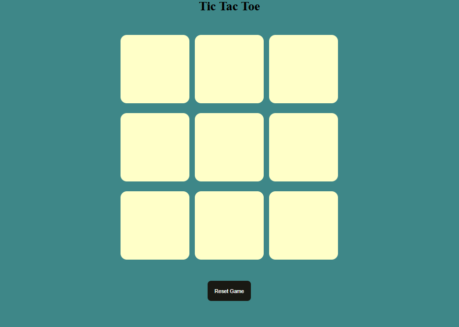
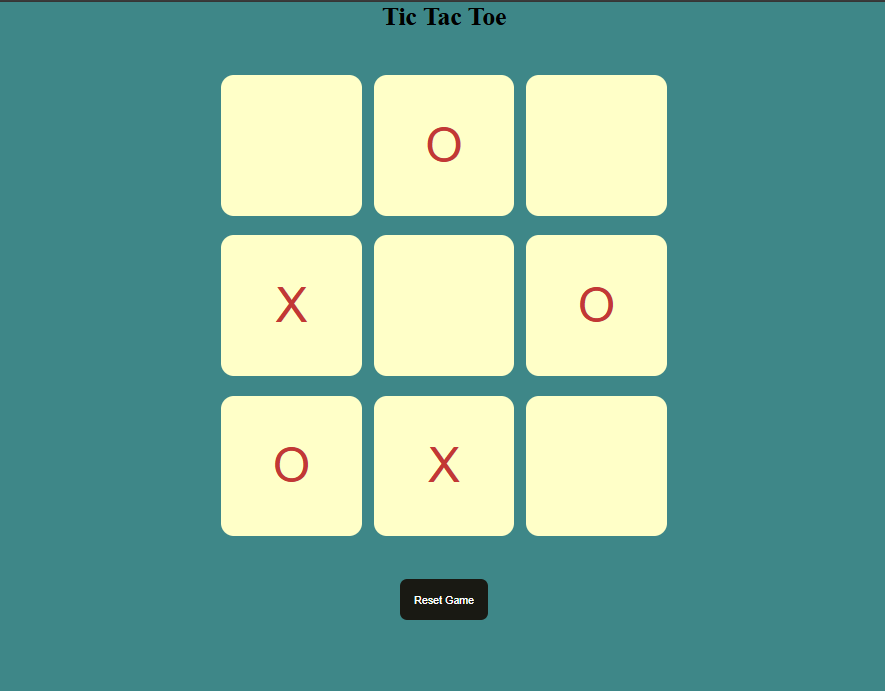
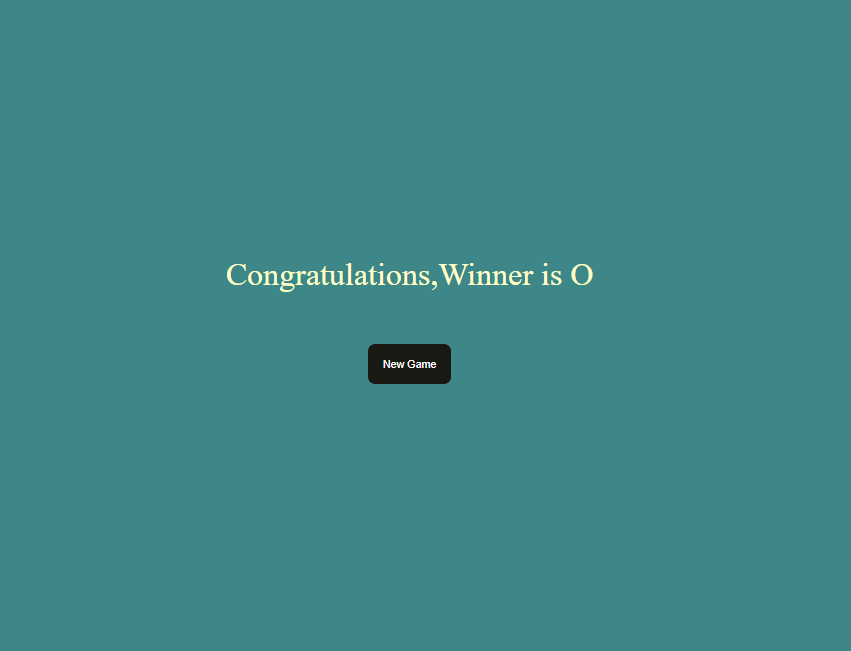

# 🎮 Tic-Tac-Toe Game

A simple web-based Tic-Tac-Toe game built using *HTML, CSS and JavaScript* to practice DOM manipulation and game logic.

---

## 📸 Screenshots

### Start Screen

### Gameplay

### Winner Announcement

---

## 🧠 What I Learned
- DOM manipulation
- Event handling
- Game logic implementation
- Condition checking

---

## 🛠 Technologies Used
- HTML
- CSS
- JavaScript

---

## 📂 How to Run Locally
1. Download or clone repository
2. Open index.html in browser

---
## 🤝 Connect With Me
 
💼 LinkedIn: https://www.linkedin.com/in/harshitha-kc14 
💻 GitHub: https://github.com/YOUR-USERNAME
